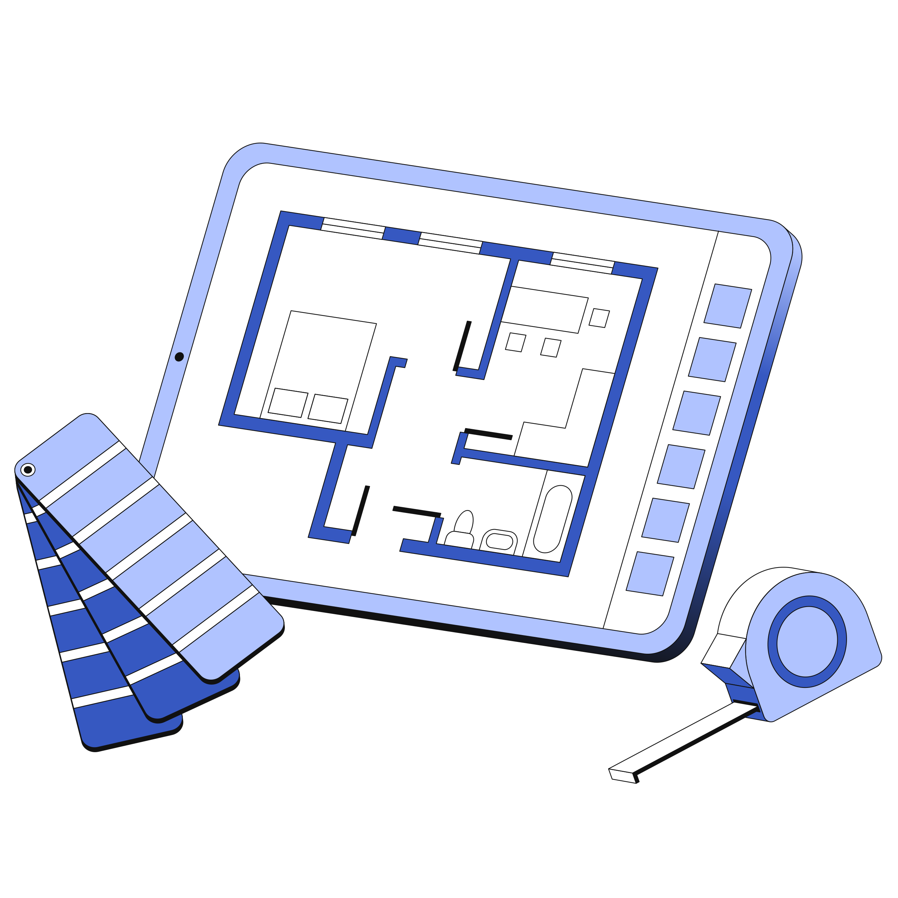

  

  
  

**`Built by MEP for MEP`**

Built by a Plumbing Engineer in Jupiter Florida, PipeLine seeks to help resolve pain points in the day-to-day life of MEP Engineers, BIM Managers, PM, etc.

---

**</>** with 🖤 [Thomas Nguyen](https://www.linkedin.com/in/tung-thomas-nguyen-9b010317b/) in [Jupiter](https://en.wikipedia.org/wiki/Jupiter,_Florida), Florida & [Tuyen Nguyen](https://qmlvietnam.github.io/) in [Melbourne](https://en.wikipedia.org/wiki/Melbourne), Australia

